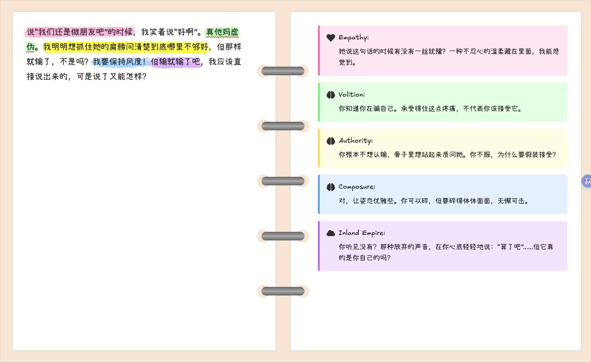

# Ink and Memory

A journaling interface inspired by Disco Elysium, where your inner voices comment on your thoughts as you write.



*Original UI Design Concept:*


## ✨ Features

- **Living Commentary**: As you write, distinct inner voices (Logic, Empathy, Volition, etc.) spontaneously comment on your thoughts
- **Dynamic Highlighting**: Voice-triggered phrases are highlighted with watercolor-style brushstrokes
- **Stateful Analysis**: LLM-powered backend remembers past comments and avoids repetition
- **Multilingual**: Supports both English and Chinese text with matching commentary language
- **Binder Aesthetic**: Beautiful notebook-style UI with ring binders and handwritten fonts

## 🎭 The Voices

13 Disco Elysium-inspired archetypes provide commentary:

- **Logic**: Wield raw intellectual power
- **Empathy**: Work your mirror neurons
- **Volition**: Keep your morale up
- **Inland Empire**: Hunches and gut feelings
- **Drama**: Detect lies and perform
- **Authority**: Assert yourself
- **Half Light**: Fight or flight
- **Shivers**: Tune in to the city
- **Composure**: Keep your poker face
- *...and more*

## 🏗️ Architecture

### Frontend (React + TypeScript)
- TipTap editor with custom voice highlighting extension
- 5-second polling with >10 character change threshold
- Instant phrase detection and highlighting
- Excalifont + Xiaolai fonts for handwritten aesthetic

### Backend (Python + PolyCLI)
- **Stateful Analyzer**: Tracks existing comments, prunes deleted phrases
- **Density Control**: Max 1 voice per persona, 1 comment per sentence
- **LLM Integration**: GPT-4 via free API proxy
- **Session Registry**: Web control panel for monitoring

## 🚀 Setup

### Prerequisites
- Python 3.11+
- Node.js 18+
- [uv](https://github.com/astral-sh/uv) for Python package management

### Backend

```bash
cd backend

# Create virtual environment and install dependencies
uv venv
source .venv/bin/activate  # On Windows: .venv\Scripts\activate

# Install PolyCLI (from parent directory)
cd ~/Codebase/PolyCLI
uv pip install -e .

cd ~/Codebase/ink-and-memory/backend

# Install additional dependencies
uv pip install beautifulsoup4 requests 'httpx[socks]'

# Create models.json with your LLM API config
cat > models.json << 'EOC'
{
  "models": {
    "gpt-4o-dou": {
      "endpoint": "https://api.example.com/v1",
      "api_key": "your-api-key",
      "model": "openai/chatgpt-4o-latest"
    }
  }
}
EOC

# Start server
python server.py
```

Server runs at `http://localhost:8765`

### Frontend

```bash
cd frontend

# Install dependencies
npm install

# Start dev server
npm run dev
```

App runs at `http://localhost:5173`

## 📖 Usage

1. Start both backend and frontend servers
2. Open `http://localhost:5173` in your browser
3. Start writing your thoughts
4. Every 5 seconds (if you've written >10 new characters), voices will comment
5. Delete text to remove its associated comments
6. Highlights show which phrases triggered each voice

## 🎨 Design Philosophy

### Vibe-Coding
This project was built using "observe-code-observe-code" rapid iteration:
- Minimal planning, maximal experimentation
- See `backend/archive/vibe-coding-scraper-example/` for a documented example

### Minimal Implementation
- Simple is better than complex
- Code buys features with complexity - spend wisely
- `@@@` comments mark tricky parts for easy navigation

## 🔧 Technical Highlights

### Stateful Commentary System
```python
class StatefulVoiceAnalyzer:
    def analyze(self, agent, text):
        # 1. Prune deleted comments
        self._prune_deleted_comments(text)

        # 2. Only ask LLM for NEW comments
        # (shows existing comments to avoid repetition)

        # 3. Enforce density rules
        # (1 per persona, 1 per sentence)

        # 4. Return ALL comments (old + new)
```

### Polling Strategy
```typescript
// Every 5 seconds, check if text changed >10 chars
useEffect(() => {
  const interval = setInterval(async () => {
    if (textDiff > 10 && !isAnalyzing) {
      const voices = await analyzeText(currentText);
      setVoiceTriggers(voices);
    }
  }, 5000);
  return () => clearInterval(interval);
}, []);
```

### Sentence Splitting (Multilingual)
```python
# English: .!?  Chinese: 。！？  Also: newlines
re.split(r'[.!?。！？]+|\n+', text)
```

## 📁 Project Structure

```
ink-and-memory/
├── assets/
│   ├── demo-screenshot.png    # Demo screenshot
│   └── book-ui-design.png     # Original UI design
├── backend/
│   ├── server.py              # PolyCLI Session Registry server
│   ├── stateful_analyzer.py   # Core voice detection logic
│   ├── config.py              # Voice archetypes & prompts
│   └── archive/               # Learning examples
└── frontend/
    ├── src/
    │   ├── components/        # React components
    │   ├── extensions/        # TipTap voice highlighting
    │   └── api/               # Backend API client
    └── public/                # Fonts & assets
```

## 🤝 Contributing

This is a personal experimental project, but feel free to fork and adapt!

## 📜 License

MIT

## 🙏 Credits

- Inspired by [Disco Elysium](https://discoelysium.com/)
- Built with [PolyCLI](https://github.com/shuxueshuxue/PolyCLI)
- Fonts: [Excalifont](https://github.com/excalidraw/excalidraw) & Xiaolai
